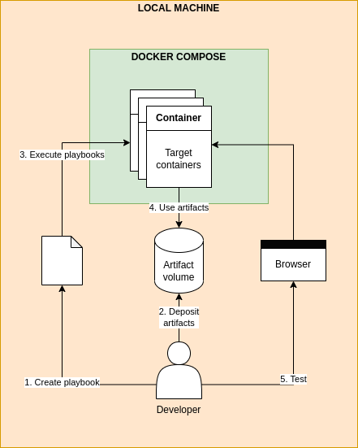

# ansible-playground

This project serves to create a minimal playground for writing and testing ansible playbooks.

## Architecture



This solution takes teh form of two docker containers:

1. The ansible controller: runs ansible and is used to execute the playbooks
2. The target server: empty CentOS container in to be configured by the ansible playbooks

## How to use

### Run the environment

Use the following commands to build and run the environment from scratch:

```bash
docker build ansible-base -t ansible-base && docker-compose kill; docker-compose rm -f && docker-compose build && docker-compose up -d
```

## Set up tools

You will need `ansible` installed on your host machine.

### Create SSH aliases for the containers

In order to connect to the containers via SSH (asnible requires this), you must first create an alias, like so:

```bash
echo "
# BEGIN: Added for ansible-playground
Host ansible-target
    HostName 127.0.0.1
    Port 6022
# END: Added for ansible-playground
" > ~/.ssh/config
```

Now connect to the container(s) for the first time to load their ECDSA fingerprint using credentials `root:root`, like so:

```bash
ssh root@ansible-target
```

### Create ansible hosts for the containers

Now let declare the containers as hosts to ansible, like so:
```bash
echo "
# BEGIN: Added for ansible-playground
ansible-target   ansible_host=ansible-target      ansible_port=6022   ansible_user=root   ansible_password=root
# END: Added for ansible-playground
" > /etc/ansible/hosts
```

### Execute a playbook

You can now execute a playbook on your container, like so:
```bash
ansible-playbook --limit ansible-target playbooks/hello_world.yaml
```